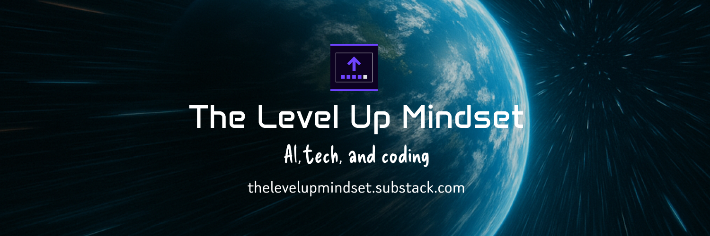

<h1 align="center">Hi, I'm Andrew Baisden! 👋 </h1>

Follow me on --> <a href="https://linktr.ee/andrewbaisden"> social media</a>

<h2>💻 TECH STACK</h2>

  

---

<h2>📝 LATEST ARTICLES</h2>

<!-- BLOG-POST-LIST:START -->
- [How Verdent Deck Supercharged My Workflow - Building Apps with Multiple AI Agents in Parallel](https://dev.to/andrewbaisden/how-verdent-deck-supercharged-my-workflow-building-apps-with-multiple-ai-agents-in-parallel-3o5g)
- [9 Productivity Hacks - AI Tools That I&#39;m Using in 2025](https://dev.to/andrewbaisden/9-productivity-hacks-ai-tools-that-im-using-in-2025-2nj4)
- [Anima Playground vs. Figma Make - Choosing the Right Vibe-Coding Tool](https://dev.to/andrewbaisden/anima-playground-vs-figma-make-choosing-the-right-vibe-coding-tool-3dhb)
- [Designing and Building an Application with Anima, Figma, and React](https://dev.to/andrewbaisden/designing-and-building-an-application-with-anima-figma-and-react-2nek)
- [12 cool open-source projects worth checking out in 2025](https://dev.to/andrewbaisden/12-cool-open-source-projects-worth-checking-out-in-2025-46ie)
<!-- BLOG-POST-LIST:END -->

---

