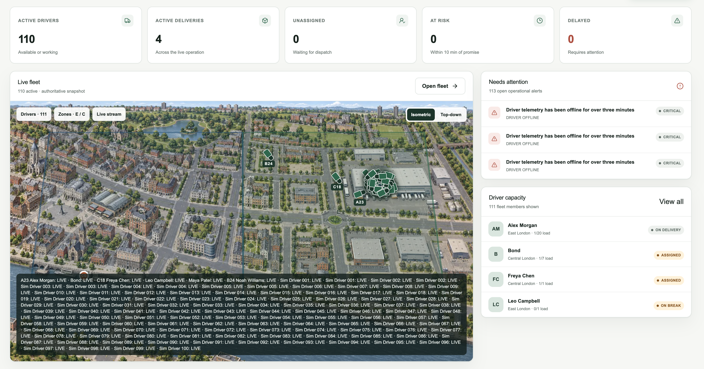
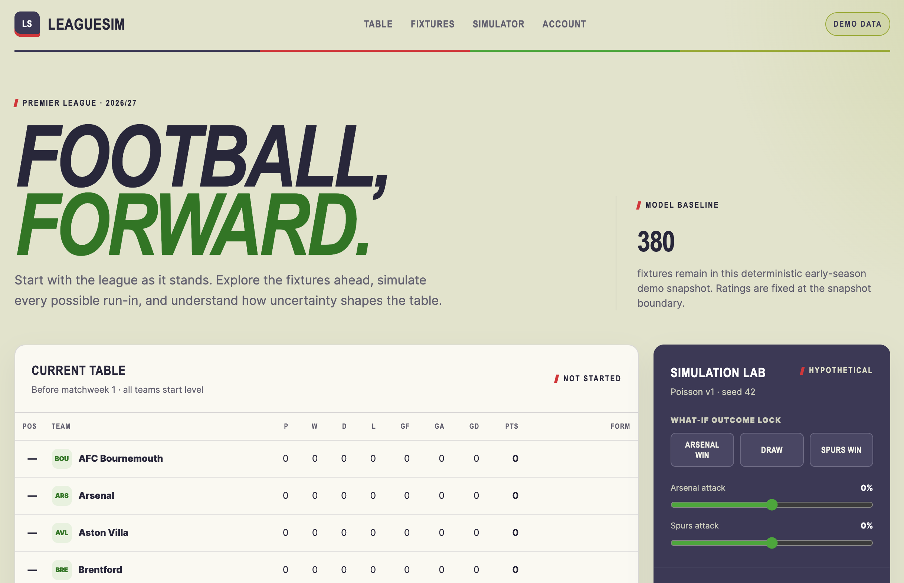
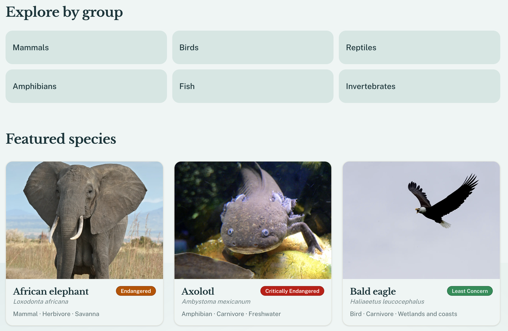
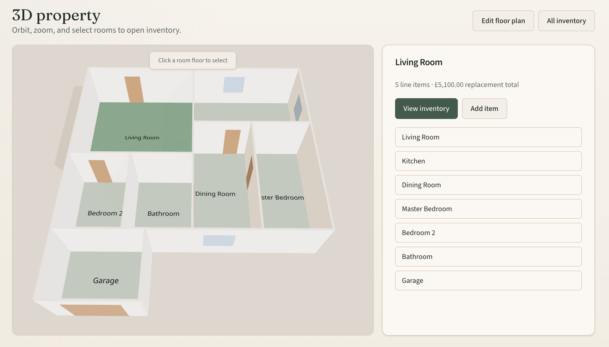

<h1 align="center">Andrew Baisden</h1>

  <strong>Full-Stack Engineer</strong> 
  Building modern web applications with TypeScript, React,
  Next.js, Node.js and PostgreSQL.

  <a href="https://andrewbaisden.com/">Portfolio</a> •
  <a href="https://www.linkedin.com/in/andrew-baisden/">LinkedIn</a> •
  <a href="https://dev.to/andrewbaisden">Technical Writing</a> •
  <a href="https://twitter.com/andrewbaisden">X</a>

---

## 👨‍💻 About

I'm a full-stack engineer focused on building reliable,
production-ready web applications.

My current work centres around TypeScript, React, Next.js,
Node.js and PostgreSQL, alongside AI-powered applications,
developer tooling and automation.

I care about clean architecture, maintainability,
performance and developer experience.

---

## 🚀 Featured Projects

### 🚚 DeliveryOS

Last-mile operations often split dispatch, tracking, and simulation across disconnected tools. **DeliveryOS** is a last-mile delivery ops platform with **dispatch, a live fleet map, telemetry, SSE, and a deterministic simulator** that runs on the same pipelines as real drivers.

Built with **Next.js** as a modern way to run operations, driver workflows, and simulated fleets on one stack.

Tech stack: **TypeScript · Next.js · React · PostgreSQL · Prisma · Redis · BullMQ · Fastify · Zod**

→ <a href="https://github.com/andrewbaisden/deliveryos">Source Code</a>

---

### ⚽ LeagueSim

Forecasting a Premier League season usually means opaque models or guesswork. **LeagueSim** is a football analytics platform that uses **seeded Monte Carlo simulations** and an **explainable Poisson model** to forecast standings, title chances, European qualification, and relegation.

Built with **Next.js** as a modern way to simulate seasons and inspect hypothetical outcomes.

Tech stack: **TypeScript · Next.js · React · PostgreSQL · Prisma · Tailwind CSS · Redis · BullMQ**

→ <a href="https://web-ten-pied-wn5lzh6lq8.vercel.app/">Live Demo</a> · <a href="https://github.com/andrewbaisden/league-sim">Source Code</a>

---

### 🦁 Fauna

Wildlife information is often scattered across field guides, encyclopedias, and static pages. **Fauna** brings them together in one application with **species profiles, comparison tools, and interactive 3D models**.

Built with **Next.js** as a modern way to explore, compare, and understand life on Earth.

Tech stack: **TypeScript · Next.js · PostgreSQL · Prisma · Tailwind CSS · better-auth · Leaflet · React Three Fiber**

→ <a href="https://fauna-tau-virid.vercel.app/">Live Demo</a> · <a href="https://github.com/andrewbaisden/fauna">Source Code</a>

---

### 🏠 Homespace

Managing property layouts, belongings, and home records often means relying on separate tools or static documents. **HomeSpace** brings them together in one application with interactive **2D floor plans, a 3D property viewer, and an insurance-ready home inventory**.

Built with **Next.js** as a modern way to visualise, organise, and document your home.

Tech stack: **TypeScript · Next.js · React · PostgreSQL · Prisma · Tailwind CSS · Zustand · better-auth · Konva · Three.js · React Three Fiber · Vitest · Playwright**

→ <a href="https://homespace-beige.vercel.app/">Live Demo</a> · <a href="https://github.com/andrewbaisden/homespace">Source Code</a>

---

## 🛠️ Tech Stack

### Core

TypeScript · React · Next.js · Node.js · PostgreSQL

### Frontend

Tailwind CSS · shadcn/ui · TanStack Query · Zustand · Konva · Leaflet · Three.js · React Three Fiber

### Backend & Data

Node.js · PostgreSQL · Drizzle · Prisma · Zod · Redis · BullMQ · Fastify · better-auth

### Testing & DevOps

Vitest · Playwright · Docker · GitHub Actions · AWS · Vercel · Fly.io

### AI Engineering

LLM APIs · Structured Outputs · Tool Calling · RAG · MCP

---

## 🧠 Engineering Focus

- Full-stack architecture
- API design
- Database design
- Testing and CI/CD
- Performance and observability
- AI agents and LLM applications
- Developer tooling and automation

---

## 🔭 Currently

Building and experimenting with production-ready full-stack
and AI applications while deepening my knowledge of system
design, cloud infrastructure and AI engineering.

---

## ✍️ Technical Writing

I write about software engineering, AI systems,
developer tooling and modern web development.

<!-- BLOG-POST-LIST:START -->
- [Configuring Data Access Control &lpar;DAC&rpar; Team Level Visibility for Enterprise AI Governance](https://dev.to/andrewbaisden/configuring-data-access-control-dac-team-level-visibility-for-enterprise-ai-governance-1nii)
- [From Vibe Coding to Vibe Computing](https://dev.to/andrewbaisden/from-vibe-coding-to-vibe-computing-4gfm)
- [LLM Guardrails in Production and How Bifrost Protects Your AI Agents at the Gateway Level](https://dev.to/andrewbaisden/llm-guardrails-in-production-and-how-bifrost-protects-your-ai-agents-at-the-gateway-level-mc6)
- [How Bifrost&#39;s MCP Gateway Cuts AI Agent Token Costs by 92% Without Sacrificing Capability](https://dev.to/andrewbaisden/how-bifrosts-mcp-gateway-cuts-ai-agent-token-costs-by-92-without-sacrificing-capability-237i)
- [AI Agents That Actually Work, Building Reliable UI Automation with Amazon Nova Act](https://dev.to/andrewbaisden/ai-agents-that-actually-work-building-reliable-ui-automation-with-amazon-nova-act-390o)
<!-- BLOG-POST-LIST:END -->

→ <a href="https://dev.to/andrewbaisden">Read more articles</a>

---

## 📊 GitHub

---

## 🤝 Connect

<a href="https://andrewbaisden.com/">Portfolio</a> · <a href="https://www.linkedin.com/in/andrew-baisden/">LinkedIn</a> · <a href="https://twitter.com/andrewbaisden">X</a> · <a href="https://dev.to/andrewbaisden">DEV</a> · <a href="mailto:info@andrewbaisden.com">Email</a>
