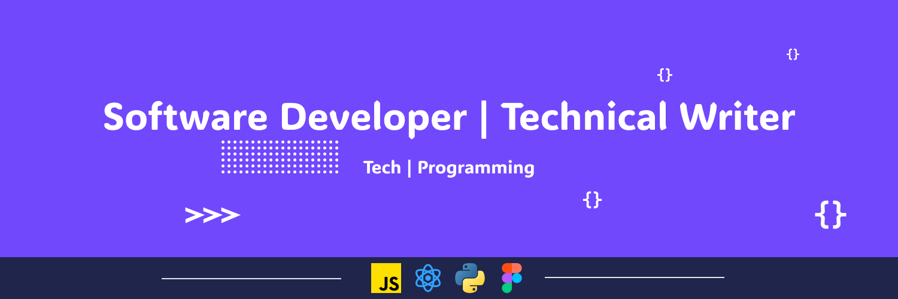

<h1 align="center">Hi, I'm Andrew Baisden! 👋 </h1>

Follow me on --> <a href="https://linktr.ee/andrewbaisden"> social media</a>

<h2>💻 TECH STACK</h2>

  

---

<h2>📝 LATEST ARTICLES</h2>

<!-- BLOG-POST-LIST:START -->
- [Designing and Building an Application with Anima, Figma, and React](https://dev.to/andrewbaisden/designing-and-building-an-application-with-anima-figma-and-react-2nek)
- [12 cool open-source projects worth checking out in 2025](https://dev.to/andrewbaisden/12-cool-open-source-projects-worth-checking-out-in-2025-46ie)
- [16 AI-powered tools for building your next project](https://dev.to/andrewbaisden/16-ai-powered-tools-for-building-your-next-project-24l5)
- [Why you should build your next React website using Astro](https://dev.to/andrewbaisden/why-you-should-build-your-next-react-website-using-astro-152f)
- [14 AI APIs Every Developer Should Know in 2025](https://dev.to/andrewbaisden/14-ai-apis-every-developer-should-know-in-2025-31il)
<!-- BLOG-POST-LIST:END -->

---

